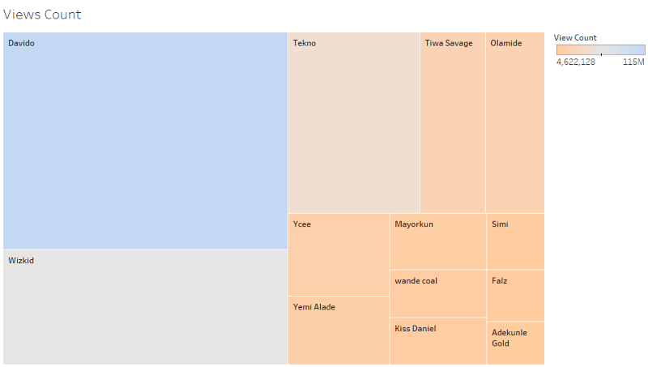
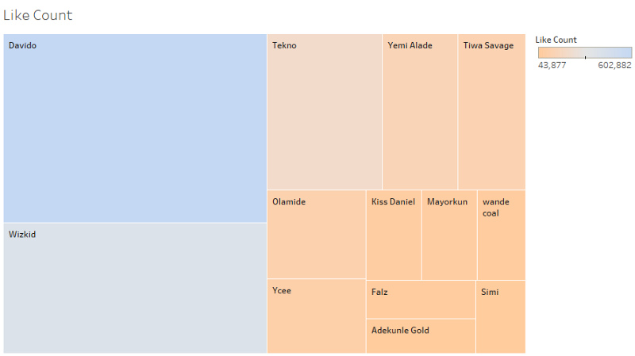
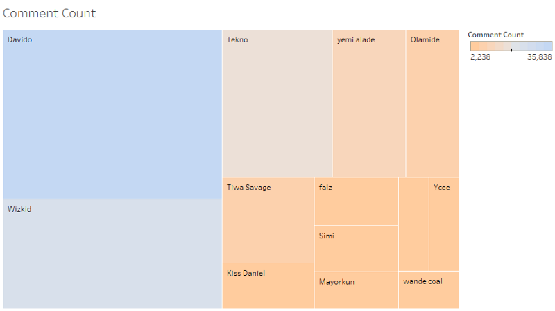
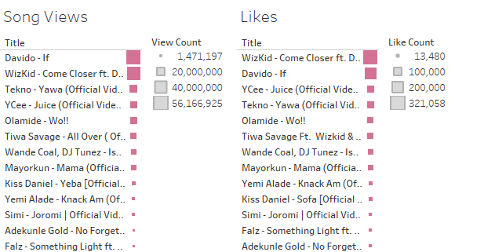

The year 2017 was good for the Nigerian music industry. There were new collaborations with local and international artists, and an array of never ending hit songs. It also had it’s fair share of controversies headlined by Wizkid’s and Davido’s [beef](https://www.vanguardngr.com/2017/11/video-wizkid-davido-physical-fight-dubai/) and [reunion](http://dailypost.ng/2017/12/25/wizkid-davido-settle-rift-stage-video/).

After reading this [article](https://www.dailytrust.com.ng/top-10-hottest-naija-artistes-of-2017.html), I began to wonder if there could be a more data driven way to come up with a top 10 list influenced by the fans and music listeners, not an award committee. Did some search that lead me to the [YouTube API](https://developers.google.com/youtube/v3/getting-started).

## The Data

The [YouTube Data api v3](https://developers.google.com/youtube/v3/getting-started) provides access to YouTube videos, channels, search, captions, comments and playlists. From a python kernel you can call the API, store the data in a dataframe and then further analyze it.

Using the YouTube API, I analysed the views, likes, comments and dislikes of the most talked about Nigerian artists and their music videos released to YouTube. I made sure the music videos used were released in 2017 and was the official release of the song from the official YouTube account of the artist. Meaning lyrics videos, dance videos, and parodies of the same song were filtered away.

I used python and pandas to manipulate the data, Tableau to visualize. You can find the code [here](https://github.com/woleoye/NigerianArtistYoutubeData).

## Analysis

I analysed 13 of the most popular Nigerian artists in 2017. I chose these artists cos their songs were the most recurring on all of the top 10 countdowns I watched on music stations.

## Artist Category

This accumulates data from all the music videos released to YouTube by each artist.

### Most Views

This analyses the artist whose music videos had the most views on Youtube. Davido won this category with 115 million views in total in 2017. IF contributed the most views garnering about 57 million views since it’s release in February.

Wizkid was a far away second with 61 million views. Tekno, Tiwa Savage and Olamide followed with 44 million, 22 million and 20 million views respectively

### Most Likes

Video likes is a bit different from views because this is the one way YouTube users express their pleasure with either the song or the artist. In this category, Davido also dominated with just over 600,000 likes in 2017. Also followed closely by Wizkid who had 416,000 likes. Tekno, the usual suspect accrued 217,000 views. Yemi Alade and Tiwa Savage were not so far away

### Most Comments

Davido also dominated this category having 36,000 comments, Wizkid is second with 23,000 comments.

It is obvious from the above that Davido was a clear favourite among YouTube listeners in Nigeria. Tekno, Yemi Alade, Olamide and Tiwa Savage were always there and about beneath them.

### Most Dislikes

Beginning to sound like a broken record but Davido again had the most dislikes on YouTube (haters gonna hate).

## Song Category

The tug of war between Wizkid and Davido never seems to end as Davido’s hit single ‘If’ accumulated 56 million views followed closely by Wizkid’s Come Closer with 51 million views (no pun intended)

Finally, Wizkid tops Davido! Wizkid Accrued about 321,000 likes on his Drake featured track Come Closer. And that about wraps up the review.

In 2017, WizKid had the most collaborations and features with international artist than any other Nigerian artist. His quest to capturing a wider audience may explain why he lagged behind Davido in most of the categories. But this really is a case of Messi vs Ronaldo where both are just too good and they have their individual years of brilliance.
