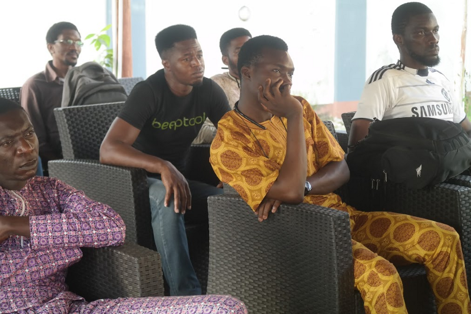
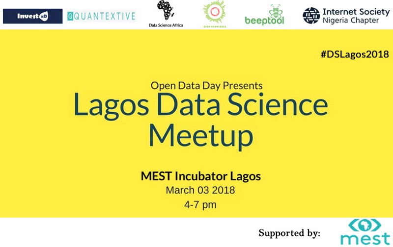

Sometime in January, I ran into my friend and fellow MEST Alum Emmanuel at the [MEST](https://meltwater.org/) incubator. We had a long chat about technology, blockchain, data science and all other frontier tech. Emmanuel got into data science before I did and I always fed off his knowledge whenever I could.

While having the conversation, we realised we needed to have more of these conversations with data science enthusiasts and practitioners alike. There and then, we decided to host a data science meetup. I’ve done this before I thought, I had organised the Product Hunt Accra meetup along with [Stephen Amaza](https://medium.com/@steveamaza) and [Tony Kharioki](https://medium.com/@kharioki) so, I was up for the ride.

Right at the spot, we chose a date. The open data day, a world-wide annual celebration of — you guessed it — open data was set to happen on the 3rd of March. This was a good day to host a data science meetup, we chose it and swiftly registered the meetup on the [open data website](https://opendataday.org/). Emmanuel returned to Ghana where he runs his company and I coordinated things here in Lagos.

## The real work begins

We picked up Asana as our coordination tool, Emmanuel registered the event on meetup.com, I drafted a proposal to sponsors, Emmanuel contacted speakers, I started informing people.

### WhatsApp

We kept at it and shortly after, we signed up 5 brilliant speakers while signing ups for the meetup was growing every second. We created a WhatsApp group for the data science enthusiasts who were signing up to connect. The group was also a way to get more people to share our marketing materials. We currently have over 30 members in the group.

Still without a sponsor, we were elated when the good people at MEST offered the use of their incubator space for free. At this point, we had signed up speakers, attendee signups was off the charts, we had secured a venue but what is a gathering in Nigeria without any sort of refreshment? We needed someone, anyone to sponsor the foods and drinks.

### Newsletter Marketing

We did all the marketing we could, we got on the Leadspace newsletter, got on the MEST blog, newsletter and social media pages and we did our fair share of social media reachouts. All this led to over a hundred signup on meetup.com.

###Sponsors came through

Eventually, we secured [Beeptools](https://beeptools.com) and [Quantextive](https://quantextive.com) as sponsor for the event. The team at Beeptools were good friends of Emmanuel's and I work at Quantextive.

## D-day

Over 60 people came for the meetup. speakers presented on machine learning tools, data visualisation, public data in Nigeria and open data.

Speakers from [MTN](https://www.mtnonline.com/), [Ubenwa](http://ubenwa.com/), [Internet Society (Nigeria)](https://isoc.ng/), [Tableau](https://www.tableau.com/), [Andela](https://andela.com/) and [Beeptools](https://www.beeptool.com/) presented at the event. We also had attendees from AI Saturday and Facebook developer circles.

Special thanks to the speakers, sponsors and supporters. I’m super excited to contribute to this community and hope to host more events soon.