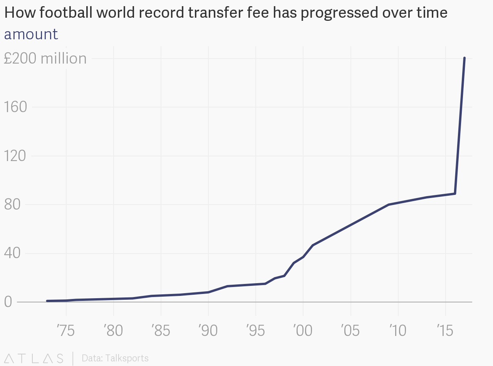
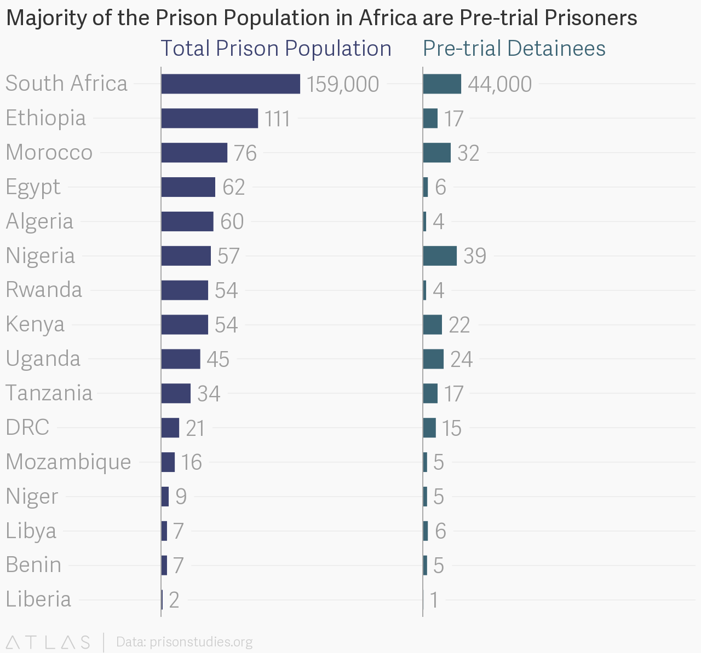
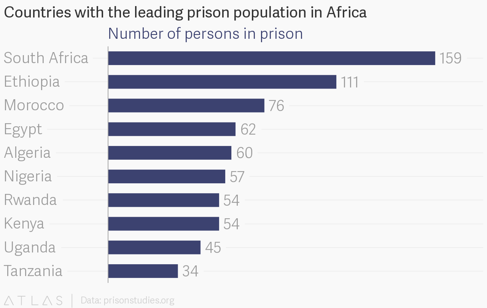

Looking from the outside-in, data science is  overwhelming. There's linear algebra involved, mixed with some calculus, statistics, and probability. Then you have to think about these programmatically which means learning how tp program. 

Coupled with these is the ability to tell stories and interpret analysis cos much of the analysis that would be done will be consumed by non-technical people. 

There are different routes to data science however, data is the lowest common denominator in all of them. These are some of the ways I have been using data.

* Obsess over any form of data I come across.
* Try to use data science tools to make sense of the data.
* Create viz, share and get feedback.

I discovered [Qz](https://qz.com)'s [Atlas](https://www.theatlas.com/) platform for charts and data visualisations. Atlas is a plug and play platfom where you only have to upload your data and move a few pieces to visualise. I decided to seek data to visualise on Atlas just for the fun of it

# What I did

I obsessed over every type of data that I curious and created charts about them on Atlas. Below are a few charts I created

---

## How football world record transfer fee has progressed over time

The highest football amount paid for a footballer was £992,000 in 1972. In 2017, £200m was paid for Neymar in a jaw dropping world record transfer.

---

## Majority of the Prison Population in Africa are Pre-trial Prisoners

I was curious about prison inmates after I came across a [petition](https://www.change.org/p/the-federal-government-of-nigeria-get-minors-out-of-nigerian-prisons) to get minors out of Nigerian prisons. I went on the search to find out about the prision population in Africa.

From a similar data set I was able to see the countries with the leading prison population in Africa.

---

## Out of every 20 student that applies to a Nigerian university, 1 is admitted

I intend to build further on this story and would like to know if the problem is

* There are just few universities in Nigeria 
* We are churning out a record number of young people from secondary schools 
* People apply to universities cos that seems to be the 'only way'
* What do these large number of people do after they do not get into a university

---

This is one way I have approached working with data. Do share with me your own methods.