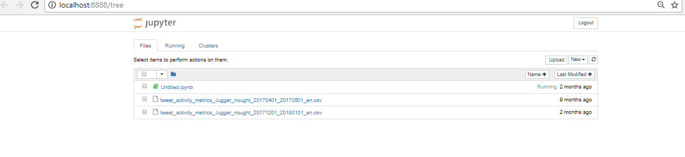
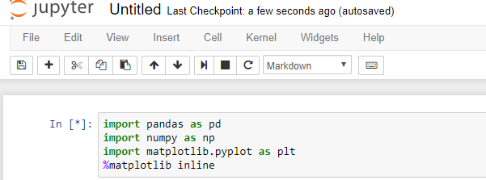
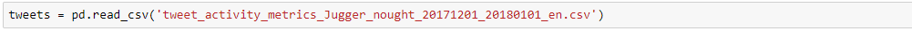
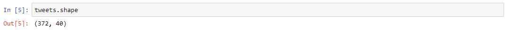
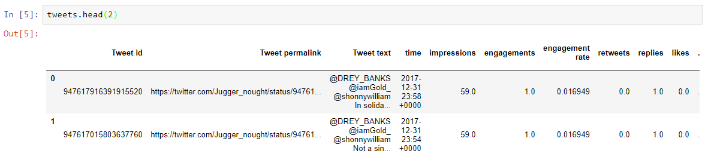
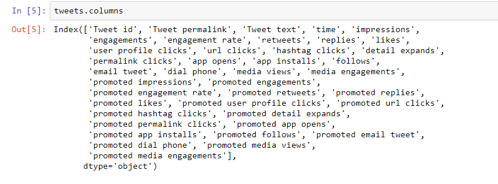
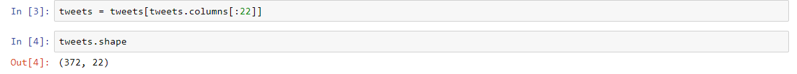
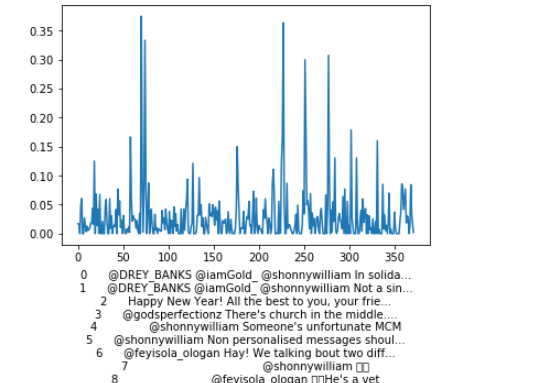
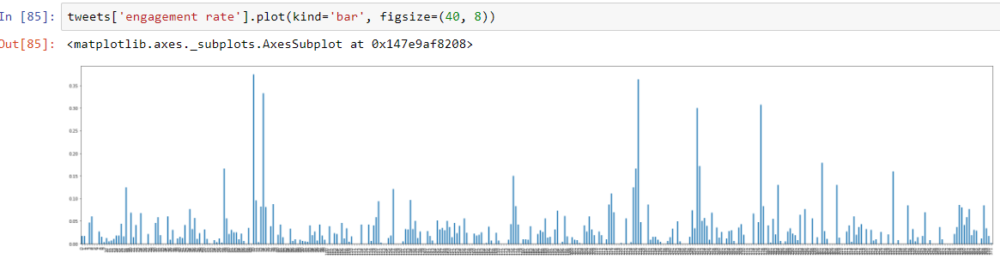
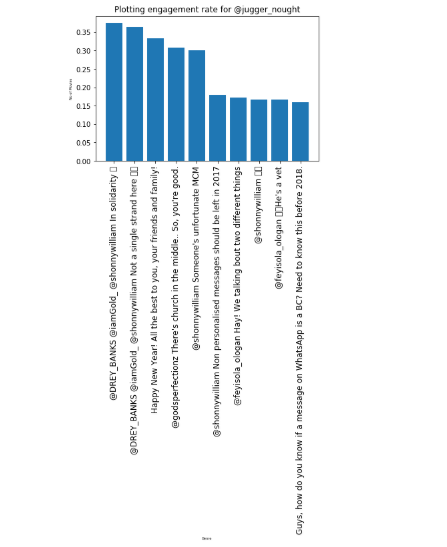

It is easy to get carried away with the big names of data analysis and forecasting such as machine learning, deep learning and forget about the most basic tools that make the above happen, good old python, python packages and Jupyter notebook. Throw SQL in the mix and more often than not, these are the tools you would need for the bulk of work you'll be doing in data science. That is why we're going to be talking about python for data science.

> We are going to explore a dataset with Python and Pandas.

The python programming language is used for data science because tools have been created on top of the language that allows the easy exploration and manipulation of data. Pandas is a tool 

Before we get started we are going to get up our environment. Make sure to install [Python 3.6][1], [pandas][2], [matplotlib][3] and [jupyter notebook][4].Often times, we use package managers to manage and install packages. You can use [Anaconda][5] or it's lighter variant [Miniconda][6]

### Dataset

The dataset you use depends on the question you want to answer. Often times, you have an hypothesis that you would like to test. There are different data sources and sometimes, you find them easy (in a machine readable and properly structured format) and other times, you may need to do a bit of recovering data from different sources and cleaning, just like I did in my [analysis][7] using the youtube API. 
For this project we're going to use data from Twitter . Twitter keeps data on each users tweets and  they make it available for download.
I will be gleaning information from my tweets from the month of December 2017 (that was my most active time on twitter in the last few  months). And I want to answer the question - Which of my tweets **had the most engagement**. This will be a really simple and straight forward exploratory data  analysis and for the purpose of this analysis, I'll be assuming that Twitter doesn't already provide a dashboard for getting this information

### Launch Jupyter Notebook

Create a project folder and put the CSV file downloaded from Twitter in it. Typing jupyter notebook launches the kernel in your browser. Sweet!

```
$jupyter notebook
```

The command launches a new notebook. You'll get a page like this



Then click the "New" drop-down menu and select **Python 3**.
After that, import the following packages.



Then use the `pd.read_csv()` function to load the CSV into pandas.



Let's review what we loaded into our dataframe using `tweets.shape`



This shows that we have 372 rows and 40 columns in our dataset. Isn't it mind blowing that for each tweet twitter generates and stores this many information that spans 40 columns.
Since information about a tweet takes up a row, I can glean that I tweeted 372 times.



Here we look at the first two rows of our dataset just to have an idea of the information in our dataset.
Looking at each column, we can see the twitter metrics like retweets, replies, likes and time the tweet was sent. It's interesting how Twitter stores other forms of data such as url clicks, user profile clicks and hashtag clicks.



From the above, we were able to confirm that 18 of our 40 columns have a promoted prefix. These columns store data for promoted tweets. But if the said tweet is not promoted, the promoted columns remains blank.

Since these promoted tweets are not going to be useful, I'm just going to do away with them.



Now we have 22 columns after removing the promoted tweets columns.

There is a lot of information you can glean from this datset. Like you can know how many people click on your profile from your tweets. I thought that was interesting.

### Exploring and Visualising

Now that we have our data and know what it contains, we can visualise. We're going to plot the 'engagement rate' column. To figure out the tweet that bombed.

```python
tweets['engagement rate'].plot(kind='bar', figsize=(40, 8))
```

This command returns the chart below



The chart looks hella messy. Let's filter down to the top 10 tweets by descending order.

### Plotting the top 10 tweets



Let's break down the above.

Setting `ascending = false`, sorts the values from highest to lowest, then we filter out the top 10 by assigning `topTweets[:10]` to the variable `topTweets`.

```python
topTweets = tweets['engagement rate'].sort_values(ascending=False)
topTweets = topTweets[:10]
```
Then we plot call plot the bar and name the X and Y axis.

```python
index = np.arange(len(topTweets))
plt.bar(index, topTweets)
plt.xlabel('Tweets', fontsize=5)
plt.ylabel('Engagement Rate', fontsize=5)
```

We then set texts that will be on the X-axis using `plt.xticks`, add a title to the chart using plt.title and show the chart using `plt.show()` . `np.arange()` returns values within a given index

```python
plt.xticks(index, tweets['Tweet text'], fontsize=12, rotation=90)
plt.title('Engagement rate for @jugger_nought')
plt.show()
```

The resulting chat is below




This is a basic exploratory data activity that can be performed on any dataset. Next steps for you will be to pick any dataset and explore!


[1]: https://www.python.org/downloads/release/python-363/
[2]: https://pandas.pydata.org/
[3]: https://matplotlib.org/
[4]: http://jupyter.org/
[5]: https://anaconda.org/anaconda/python
[6]: https://conda.io/miniconda.html 
[7]: https://medium.com/@OluwoleCo/nigerian-music-industy-who-won-2017-6eb645b65046
[8]: https://github.com/OluwoleCo/NigerianArtistYoutubeData
[9]: https://analytics.twitter.com


