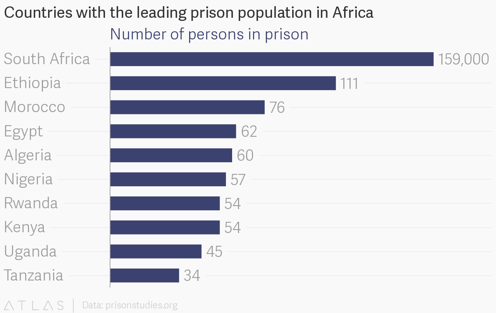

I stumbled on [this petition](https://www.change.org/p/the-federal-government-of-nigeria-get-minors-out-of-nigerian-prisons) about the inhumane treatment of minors in Nigerian prisons.


These children are usually poor and often picked off the street by the Nigerian police and used to make the numbers in prison cells. They are either petty thieves, wanderers and street hawkers. Held in the same cells along with these kids are convicted murderers, armed robbers, rapists and the likes.

``` 

It then took me down the rabbit hole of the Nigerian and African prison data .

 ```

Thanks to the [World Prison Brief](https://Prisonstudies.org) a database that provides access to information about prison systems throughout the world, I was able to get the data of the prison population in Africa.

In a [report](https://www.dailytrust.com.ng/news/general/how-kids-are-locked-up-with-adults-in-nigerian-prisons/210783.html) by the Daily Trust Newspaper, minors are held against there wish and coerced to increase their age so as to keep them in prison. Here's a quote from the report.

> "police prosecutors on many occasions fail to come up with the right criminal charges against the minors and they do not request for them to be remanded in remand homes or juvenile homes. The kids also claimed investigators forced them to increase their actual ages to cover up and justify their remand".

By the [2015 estimate](http://www.prisonstudies.org/country/nigeria), Nigeria has 1.7% of it's prison population. About 1,300 minors are sitting in Nigeria's prisons across the country.



From the chart above, it is pretty obvious that the countries with the highest persons in prison also had the highest population. On the top 10 countries that was charted above, the  country with the highest number of persons in prison, South Africa has a population of 54 million and the country that placed 10th, Tanzania has a population of 51 million. 

Most of the countries on the list had a population within that range with the exception of Nigeria with a population of 181 million and a very curious case of Rwanda which has the least population on the chart at 11 million

# The curious case of Rwanda

For a country with a population of 11 million, Rwanda has an insanely high  prison rate. As a matter of fact, Rwanda has the highest prison rate in Africa. 


Population rate is  calculated per 100,000 of the national population. This means, for every 100,000 Rwandans, 464 of them are incarcerated .

Rwanda's high prison population rate may not be far removed from the Rwandan genocide that happened 24 years ago. According to a [report](https://www.hrw.org/news/2014/03/28/rwanda-justice-after-genocide-20-years) by the human right's watch, some Rwandans were detained and tried in the absence of solid evidence.

> "Compared with most other countries emerging from mass violence, Rwanda's determination to see justice done and its progress in trying so many alleged perpetrators in less than 20 years have been impressive. But some have paid a high price. In the late 1990s and early 2000s, in particular, thousands of people were arbitrarily arrested, and many were charged and tried in the absence of solid evidence against them. Some might have been wrongly convicted. The lack of safeguards against abusive prosecutions in a weak judicial system heightened the risk of unfair trials".

The slow rate of trial and the incarceration of some people without solid evidence must have led to the high rate in prison population in Rwanda.

# Mass incarceration in Nigerian Prisons

The majority of people incarcerated in Nigeria are awaiting trial—denied bail and incarcerated in advance of their trial—and therefore, are legally innocent.


There is a big chance most of the incarcerated persons are there because they couldn't make bail but I couldn't get the data to test that.

