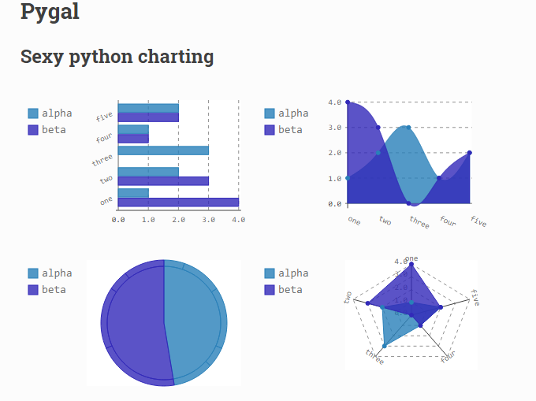
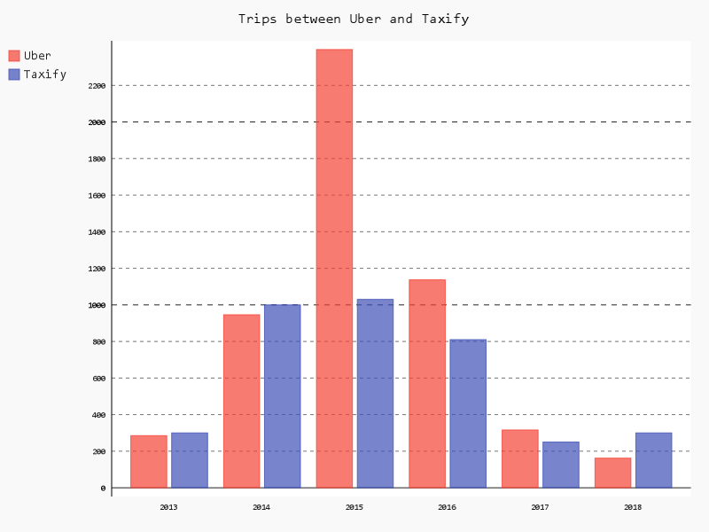

Off the cuff, Matplotlib has always been my plotting library when making quick visualisations on my notebook. I'm pretty sure every one uses it. While it is hard for me to admit, I still find it hard to work with Matplotlib, I google the API everytime and it is not as flexible as I would have loved it to be. 

I went on the search for charting libraries that I may find easy to use and after exploring Seaborn, Bokeh and a few others, I stumbled on Pygal and loved it.

[Pygal](http://www.pygal.org) not only allows you create visualisations but it specialises in creating them in interactive SVGs. I sometimes want my charts to be in png or any other format and that is possible as well.

What won my heart the most however is how one can create line charts, bar graphs etc, with very little line of code.

# Pygal in action

## Install the package
Install Pygal

```python
pip install pygal
```
Then import into your file

```python
import pygal
```

## Create a bar chart

I will be graphing the number of uber trips and Taxify trips I went on between 2013 and 2018. N.B: These are not real data.

```python
barChart = pygal.Bar()
```

You can create any other chart using the `pygal.Line()`, `pygal.HorizontalBar()`. See [here](http://www.pygal.org/en/stable/documentation/types/index.html) for other types of charts that can be created.

## Add title and some values

```python
barChart = pygal.Bar()
barChart.title = 'Trips between Uber and Taxify'
barChart.x_labels = map(str, range(2013, 2019))
barChart.add('Uber', [285, 946, 2396, 1137, 316, 162])
barChart.add('Taxify', [300, 1000, 1030, 810, 250, 300])
```
`barChart.x_labels` adds the labels to the x-axis. Above, we set range from 2013 to 2018 which is 6 years. 

The `.add` method adds two bars for each year for Uber and Taxify

And we're done! What is left now is for us to visualise the chart.

## Visualise chart

 This can be done in a few different ways. Pygal defaults to rendering the chart in SVG format.

 Hence, if you are using a Jupyter notebook, it will not show the plot by default. Use the below method

 ```python
barChart = pygal.Bar()
barChart.title = 'Trips between Uber and Taxify'
barChart.x_labels = map(str, range(2013, 2019))
barChart.add('Uber', [285, 946, 2396, 1137, 316, 162])
barChart.add('Taxify', [300, 1000, 1030, 810, 250, 300])
 display({'image/svg+xml': bar_chart.render()}, raw=True)
 ```
To save the image to file, a package called CairoSVG is required to save the chart as an image. 

First install and import cairoSVG

```
pip install CairoSVG
```
then 

```python
import cairoSVG
```

```python
barChart = pygal.Bar()
barChart.title = 'Trips between Uber and Taxify'
barChart.x_labels = map(str, range(2013, 2019))
barChart.add('Uber', [285, 946, 2396, 1137, 316, 162])
barChart.add('Taxify', [300, 1000, 1030, 810, 250, 300])
barChart.render_to_png('year articles.png')
```



---

And that's all you need to know about pygal. Checkout the [docs](http://www.pygal.org/en/latest/documentation/) to know to tweak the chart in the direction of your choosing.


