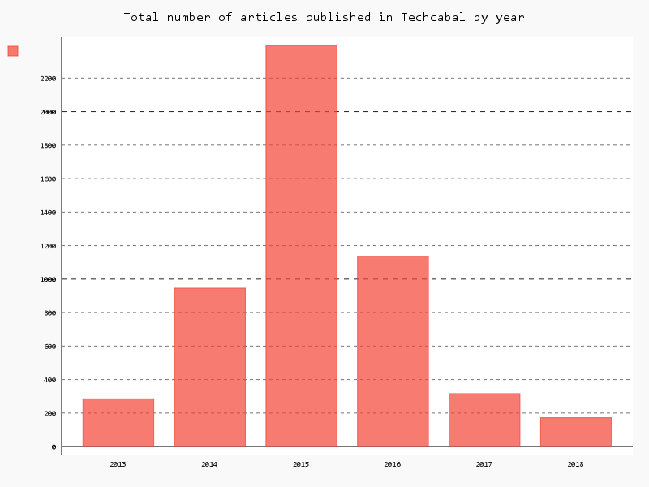

Startups in Africa have experienced increasing access to venture capital over the last few years. I have actively been following the scene in the last few months and [wrote about it here][1].

Working on the above linked article, I realized getting pre-2017 funding data was challenging and almost unavailable. So I came up with the idea to track the funding announcements of two notable tech startup publications–Techcabal and Techpoint–to see what info I could find. The platforms are arguably two of the leading startup publications in Nigeria, hence, they would have adequate information on funding announcements in Nigeria and maybe across Africa.

I found different trends in the data and decided to have some data-driven fun.

# The data: How I obtained it

In order to pull the data from the websites of Techcabal and Techpoint, I wrote a script to grab all historical headlines dating from the beginning of both publications to Sunday, 2 September 2018. With some Pandas-aided regular expression, I was able to extract valid information about funding announcements from the story headlines.

Along with the headlines, I got the date the article was published and checked if each of those articles were sponsored articles or not. I made some more analysis on the sponsored articles just for the fun of pitting both publications against each other. [The code I used to do all this is available on GitHub][2].

# Analysis: My findings

I started with Techcabal. Covering periods between 30 March 2013 and 02 September 2018, Techcabal made 98 funding announcements, with the most announcements happening in February 2015.

Looking at the chart, we can see that funding announcements have been steady but not particularly on the rise month-on-month.

There’s been an ongoing narrative that funding into the Nigerian/African ecosystem has been on the rise. Does this dispute that?

From my analysis, it could be one of two things.

Techcabal may be selective with the funding announcements they reported on or my script didn’t collect all the funding data appropriately.

After looking closely, I realised, in 2018, Techcabal has made just [one funding announcement on their website][3].

This made me more curious about what Techpoint, the other popular tech publication, had been up to (or not) with funding announcement. So, I grabbed all Techpoint’s published posts from inception. This covered the period from 24 December 2014 to 2 September 2018.

An almost similar trend from Techpoint.

Techpoint had 64 funding announcements. Significantly less than Techcabal, but Techpoint launched almost two years after Techcabal.

But look at 2018, Techpoint seemingly has been the goto publication for funding announcements this year. Is there a reason why?

Since these publication report on more than just funding announcements, the obvious next question for me was, “**How has the total number of articles changed over time on these publications?**”

---

It turns out Techcabal had periods particularly in mid-2015, when the publication was churning out articles as many as 238 articles per month, an average of 11 articles per day and periods where, well, they didn’t publish as many. Techcabal’s first post went out in March 2013. They went complete beast-mode from 2014 to early 2016, regularly publishing north of 100 articles per month.

In the above middle finger looking chart, Techcabal’s golden year appears to have been 2015, where the publishing house churned out 2,396 articles, an average of 199 articles per month. I would personally love to speak with the team about how they achieved that feat. In 2017, they published only about a 10th of what was published in 2015. I have questions about the increase/decline in traffic due to this.

The data is even more interesting for Techpoint who have been fairly consistent with their articles and in 2018 alone have so far published 736 articles compared to Techcabal’s 172.

Techpoint launched in December 2014 with four articles that month but boy did they ramp up quickly — already by 2015, the company have published over a thousand articles. There was an obvious need for tech news that Techcabal alone could not fill.

The growth paid off seeing as Techpoint’s website traffic [increased 600% in 2016][4].

---

# The money bit?

The last bit of data left for me to analyse was the “sponsored” articles. Sponsored post are kinda like ads and a major revenue stream for online publications. Reviewing this info will give us an idea of how both companies tweak output in relation with their business model.

Techcabal is killing it when it comes to making money. Having as many as 40% and sometime 80% of posts being sponsored. They even had two months in 2018 (February and March) where all released posts were sponsored. It is almost obvious that Techcabal has had its focus on increasing revenue over the last year or two. Total posts published have more than halved and sponsored articles showed an upward trend.

Of course, it is no longer news that Techcabal has widely followed [newsletter][5] and that the focus of the company may be shifting to that.

Techpoint churns out quite a lot of posts and it is little wonder they make money from less that 30% of their posts. It has however seen a steady increase over time from having sponsored articles being as low as 2% of total posts to currently having at about 20% of posts being sponsored. Techpoint recently rebranded to cover stories across Africa

-----

While this is a review of tech publications, it is also testament to the progress the Nigerian tech ecosystem has experienced in as little as 5 years. It is also amazing to see deal sizes and valuations to have more or less been growing accordingly. And a quick shoutout to Techcabal, Techpoint and other tech publications for documenting them all.

**PS**: I have no official affiliation with Techcabal andTechpoint

[1]: https://hackernoon.com/state-of-africa-vc-investing-in-2018-d77947337ba7
[2]: https://github.com/OluwoleCo/TC-TP-Analysis
[3]: https://techcabal.com/2018/06/27/announcing-our-investment-in-bitkoin-africa/
[4]: https://techpoint.africa/2017/01/01/techpoint-2-year-anniversary/
[5]: https://techcabal.us7.list-manage.com/subscribe?u=516543d20461f295636a963ec&id=ebb229e161