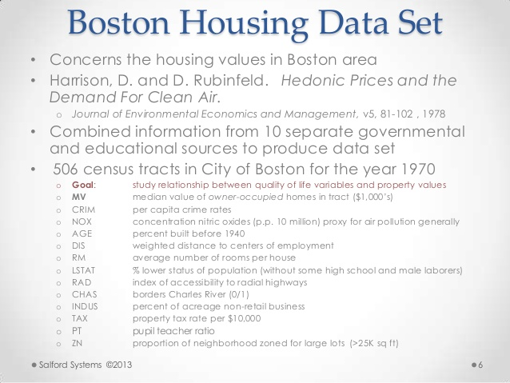
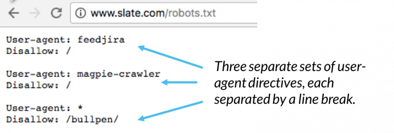
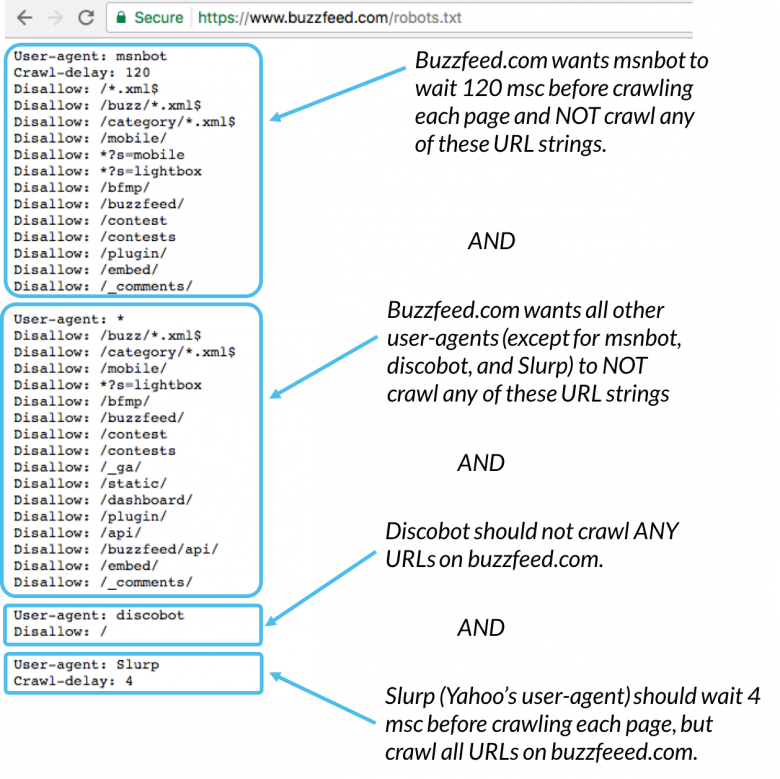
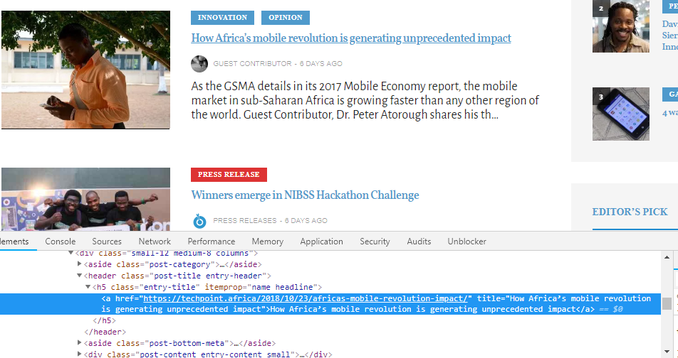

As a new data scientist, I always wanted to work on projects with familar data. But  often time, it's not possible because first, data is hard to find store and maintain. Especially in Africa, you often do not find data you need.



After classifying the boston housing dataset for the 100th time, you'll realise that using other people's data can be boring. 

One easy but sure way to get your own data is by web scraping. Petabytes of data is left mostly free and available for use on websites. It'll make or a fun project to get these data, convert them to insights.

Web scraping is a process of extracting data from websites and presenting it in format you can easily make sense of.

The job is done by a scraper which is a piece of code that parses an HTML document based on certain criteria, it then converts the data it gets into specific format. The data can be text, images, videos etc.

In this exercise, We are going get headlines from a tech new headlines so we can do some fun stuff with it. Since it's text data, we can decide to do some sentiment analysis, some exploratory time series or have some NLP fun.

---

# Getting Started

We are going to use Python as our scraping language, together with a simple and powerful library, BeautifulSoup.

# 1. check the websites's robots.txt

Websites are certain people's property and as a user, you are required to use it a certain way. People who build websites however, know that certain people will try to use it in a way that didn't intend for it to be used one of those ways is scraping. 



They can't stop scraping but they have often have a rule for you to abide by if you wish to scrape their website and that is why they often have a robots.txt file. Most websites have one Twitter, Facebook etc. Robots.txt provide guidance on how to scrape the website, what pages to scrape, etc. Read [here][1] for more on this.




# 2. Libraries 

```python
import urllib2
import csv
from bs4 import BeautifulSoup
import pandas as pd
```

* **urllib2** : Our library for making url requests.
* **csv**: Library to store data in a CSV
* **bs4**: The beautiful soup library that makes extracting data from a webpage very easy.
* **pandas**: Store the data in a nice tabular format.

# 3. Understand the website

The Techpoint website is pretty straight forward. Let's break down the website.




https://techpoint.africa/ is the root domain.

https://techpoint.africa/page/{number} is a list of all the articles published on Techpoint but divided into pages by numbers.

Thinking about this, we can loop through the pages and get the data we need.

for this exercise, we only need the headlines hence, the above url will suffice.

Next we look at the html elements to know what tags the content we need are wrapped in. We use the chrome inspect tool for this.

# 4. Making URL requests

Remember, we were going to loop through all the pages so we can get the headline. Techpoint's first page however cannot be part of that process. This is because of how the page has been structured. Techpoint has a URL http://techpoint.africa while we intend to loop through all pages with URL http://techpoint.africa/page/{pagenumber}. pagenumber is the number of the page.

So, we  make a request to the first page and scrape that individually before looping through and make the same request to the other pages.

we use the urllib2.Request to request for the page and Urllib2.urlopen to read the page data

```python
url = 'https://techpoint.africa/'
page = urlopen(url)
```

# 5. Extracting data

At this point, we use beautiful soup to parse the HTML and get our data from the page. When Beautiful Soup reads in the data, we can now go through the page and find the html tags we need.

From the page, we're getting the following data and it's type

date: datetime
sponsored: boolean
headline: text

Date: extracts the date the post was published
Sponsored: is a boolean that checks if the post is a sponsored post or not. It is true if the post is sponsored
headline: extracts the headline text

```python
table = []

soup = BeautifulSoup(page, 'html.parser')
div = soup.find('div', attrs={'class': 'posts'})
for tag in div.find_all('div', attrs={'class' : 'medium-8'}):
    websiteData = {
        'date': '',
        'sponsored': False,
        'headline': ''
    }
    date = tag.find('time')['datetime']
#     print(tag.find('span', attrs={'class': 'entry-category'}).a.text)
    sponsored = False
    if tag.find('aside', attrs={'class': 'post-category'}).a.text == 'Sponsored':
        sponsored = True
        
    headline = tag.find('h5').a.text
    websiteData['date'] = date
    websiteData['sponsored'] = sponsored
    websiteData['headline'] = headline
    
    table.append(websiteData)
```

We store the data we got in a dictionary and put it in the table array.


Now time for the other pages. At the time of writing this article, there are 818 pages so, we need to get the URLs

```python
linkArr = []
techpoint = 'https://techpoint.africa/page/'
for i in range(2, 819):
    linkArr.append(techpoint + str(i) +'/')
```

linkArr has all the URLs we wish to parse

We will extract the data like we did above only this time, we look through all the URL.

```python
  for link in linkArr:
        try:
            page = urlopen(link)
        except (http.client.IncompleteRead) as e:
            page = e.partial   
            
        soup = BeautifulSoup(page, 'html.parser')
        div = soup.find('div', attrs={'class': 'posts'})

        for section in div.find_all('div', attrs={'class' : 'medium-8'}):
            websiteData = {
                'date': '',
                'sponsored': False,
                'headline': ''
            }
            date = section.find('time')['datetime']
            sponsored = False
            if section.find('aside', attrs={'class': 'post-category'}).a.text == 'Sponsored':
                sponsored = True

            headline = section.find('h5').a.text

            websiteData['date'] = date
            websiteData['sponsored'] = sponsored
            websiteData['headline'] = headline

            table.append(websiteData)
```
# 5. Save data

We use pandas to convert the list into a table 
Then we save to CSV

```python
table = pd.DataFrame.from_dict(table)
table.to_csv('headlines.csv')
```

Now we have generated our data set and can now use it as I did [here][2]

[1]: https://benbernardblog.com/web-scraping-and-crawling-are-perfectly-legal-right/

[2]: https://www.oluwole.co/journal/What-I-learned-about-nigerian-tech-funding/

