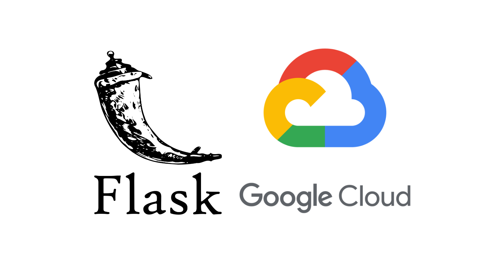

Flask makes it possible for developers to build an API for whatever use case they might have. In this tutorial, we’ll learn how to set up Google Cloud, Cloud SQL, and App Engine to build a Flask API. (Cloud SQL is a fully managed platform-as-a-service (PaaS) database engine, and App Engine is a fully managed PaaS for hosting applications.)

A few Python frameworks can be used to create APIs, two of which are Flask and Django. Frameworks comes with functionality that makes it easy for developers to implement the features that users need to interact with their applications. The complexity of a web application could be a deciding factor when you’re choosing which framework to work with.

To continue reading, head over to [Smashing magazine][1]

[1]: https://www.smashingmagazine.com/2020/08/api-flask-google-cloudsql-app-engine/